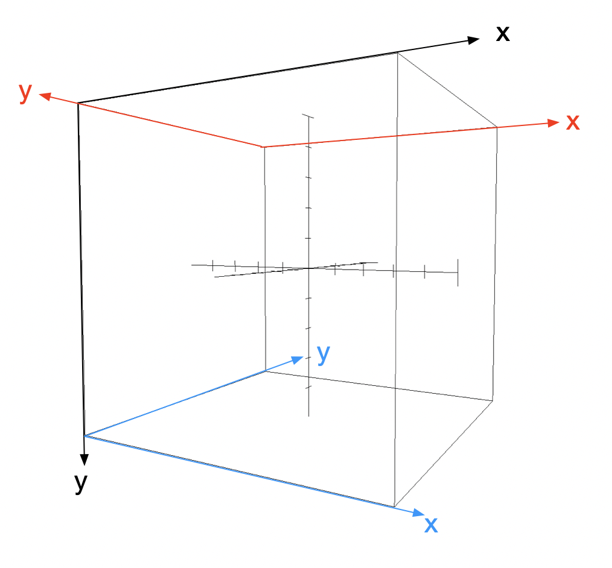

#### I have some confusions in learning the omnidirectional shadow and I list them in following:
#####&emsp;&emsp;1. The up vector of shadowTransform array
&emsp;&emsp;It's because the cube texture coordinate. Look at the following picture:

That's why the positive X's up vector needs to be vec3 ( 0.0, -1.0, 0.0 ), and it can be used in other faces. It's little bit difficult to verify it because you have to adjust the direction (plus or minus) and the displacement.
&emsp;&emsp;For the light position vec3 ( 0.0, 0.0, 0.0 ), you can just do this in geometry shader when your shadowTransform is :
```C++
shadowTransform.push_back(shadowProj * glm::lookAt(lightPos, lightPos + glm::vec3( 1.0,  0.0,  0.0), glm::vec3(0.0, 1.0, 0.0)));    // right
shadowTransform.push_back(shadowProj * glm::lookAt(lightPos, lightPos + glm::vec3(-1.0,  0.0,  0.0), glm::vec3(0.0, 1.0, 0.0)));    // left
shadowTransform.push_back(shadowProj * glm::lookAt(lightPos, lightPos + glm::vec3( 0.0,  1.0,  0.0), glm::vec3(0.0, 0.0, -1.0)));     // up
shadowTransform.push_back(shadowProj * glm::lookAt(lightPos, lightPos + glm::vec3( 0.0, -1.0,  0.0), glm::vec3(0.0, 0.0, 1.0)));    // bottom
shadowTransform.push_back(shadowProj * glm::lookAt(lightPos, lightPos + glm::vec3( 0.0,  0.0,  1.0), glm::vec3(0.0, 1.0, 0.0)));    // front
shadowTransform.push_back(shadowProj * glm::lookAt(lightPos, lightPos + glm::vec3( 0.0,  0.0, -1.0), glm::vec3(0.0, 1.0, 0.0)));    // back
```
&emsp;&emsp;The geometry codes:
```GLSL
#version 330 core
layout(triangles) in;
layout(triangle_strip, max_vertices=18) out;

uniform mat4 lightSpaceMatrices[6];

out vec4 FragPos;

void main(){
    for(int i = 0; i < 6; i++){
        gl_Layer = i;
        for(int j = 0; j < 3; j++){
            FragPos = gl_in[j].gl_Position;
            vec3 pos;
            if(face < 2)
                pos = vec4(FragPos.x, -FragPos.y, -FragPos.z, 1.0);
            else if(face < 4)
                pos = vec4(-FragPos.x, FragPos.y, -FragPos.z, 1.0);
            else
                pos = vec4(-FragPos.x, -FragPos.y, FragPos.z, 1.0);
            gl_Position = lightSpaceMatrices[i] * pos;
            EmitVertex();
        }
        EndPrimitive();
    }
}
```
&emsp;&emsp;But if your light poisition isn't vec4 ( 0.0, 0.0, 0.0 ), you have to considerate the displacement. You can calculate the lookAt matrix by yourself.
#####&emsp;&emsp;2. Why is FragPos-lightPos in shader.fs
&emsp;&emsp;This is also because of cube texture coordinate, you can calculate positive x axis's lookAt transform matrix( light position is vec3( 0.0, 0.0, 0.0) ) to transform the point( 1.0, 1.0, 1.0 ), then you can get ( -1.0, -1.0, -1.0 ) which is exectly from light to fragment posiiton( contrary to retrieve the cube fragment).

####&emsp;&emsp;Addition
&emsp;&emsp;To solve these confusions, I find some web sites to refer. I put them at the bottom.
&emsp;&emsp;&emsp;&emsp;1. [Do not understand captureViews in Diffuse-irradiance tutorial in learnopengl.com]( https://stackoverflow.com/questions/56515732/do-not-understand-captureviews-in-diffuse-irradiance-tutorial-in-learnopengl-com)
&emsp;&emsp;&emsp;&emsp;2. [Convention of faces in OpenGL cubemapping](https://stackoverflow.com/a/11694336)