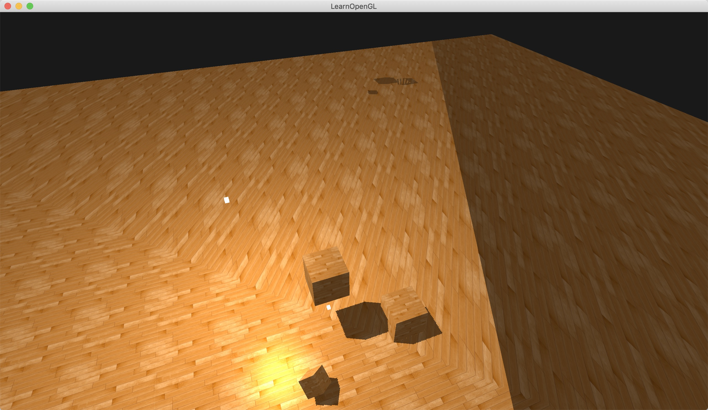
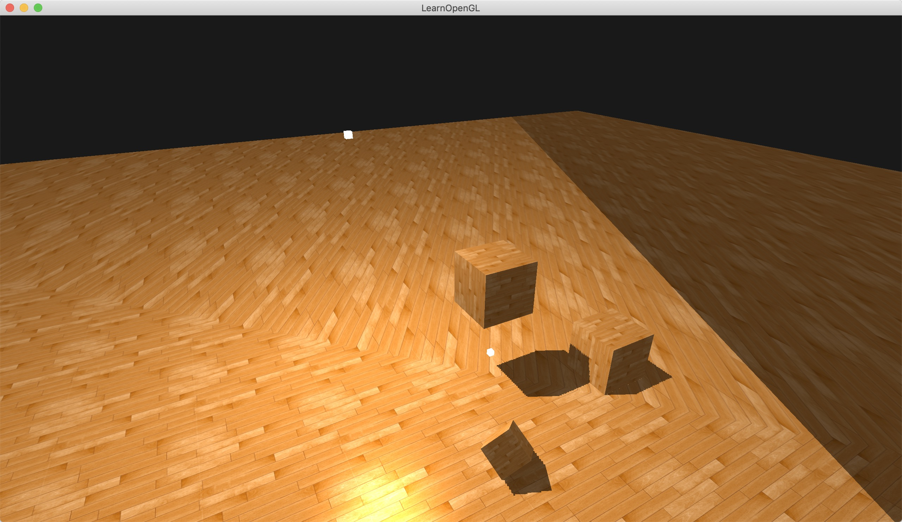

&emsp;&emsp;My over sampling issues isn't as same as tutorial. It has the following effect when I use GL_REPEAT.

&emsp;&emsp;In the picture you can find two shadows of objects (This obvious effect needs to remove the attenuation factor). But when I use the solution (replace the GL_REPEAT with GL_CLAMP_TO_BORDER) suggested by tutorial, I got the same effect as the wrong effect. But this operation can remove the repeat shadows. It's useful! The effect like following picture:
