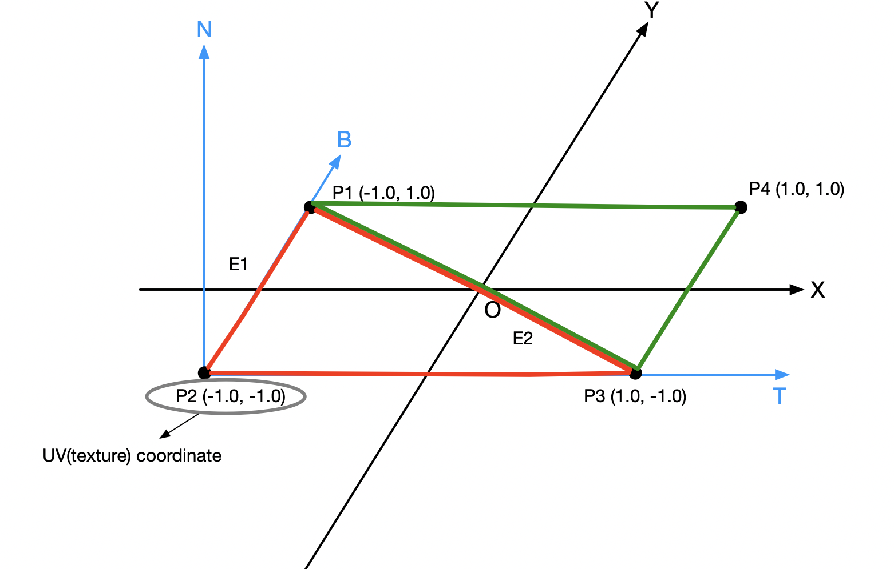

&emsp;&emsp;In vertex shader, I use the cross(T, N) instead of the static normal vector vec3 ( 0.0, 1.0, 0.0 ), but I don't understand the equation ```     T = normalize(T - dot(T, N) * N); ``` in tutorial's example vertex shader codes. I also remove the member ```vec3 TangentFragPos``` and use the ``` vec3 FragPos ```.
&emsp;&emsp;I don't think the legend of tangent space in tutorial is enough clear, actually it makes me confused. So I draw the legend with my understanding. Here is my legend and the statements:
```
     The black axes are in model space coordinates axis, and the blue axes are texture coordinate (These directions are coming from the 
tutorial codes)
    This quad texture is made by two triangle (red and green) we often use, and they have their own Tangent and Bitangent vector. 
In the tutorial, the variables E1(edge1 in codes) is the vector point from the P1 to P3 and the E2 is the pointing from P1 to P2. We can
also use other two edges (any direction or edge), as long as they are in one triangle. In the codes, the red one is T1 and B1, the green 
one is T2 and B2. And the calculation process is as same as the tutorial. I hope this legend can give you a clear understanding of 
tangent space.
```



&emsp;&emsp; It's better to read this by tangent_space.graffle