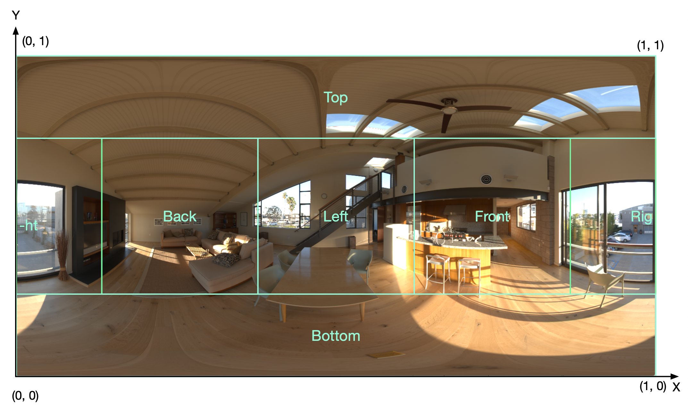
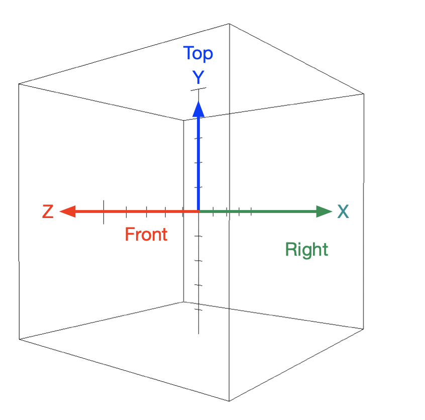
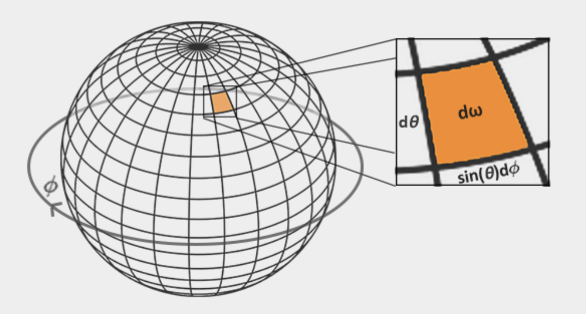
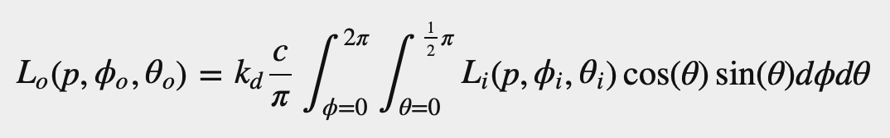
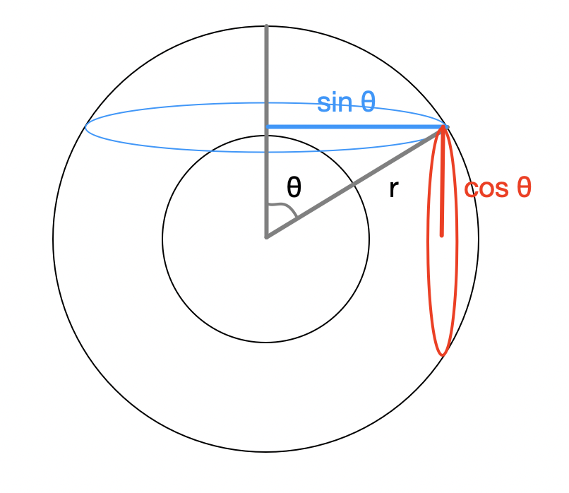
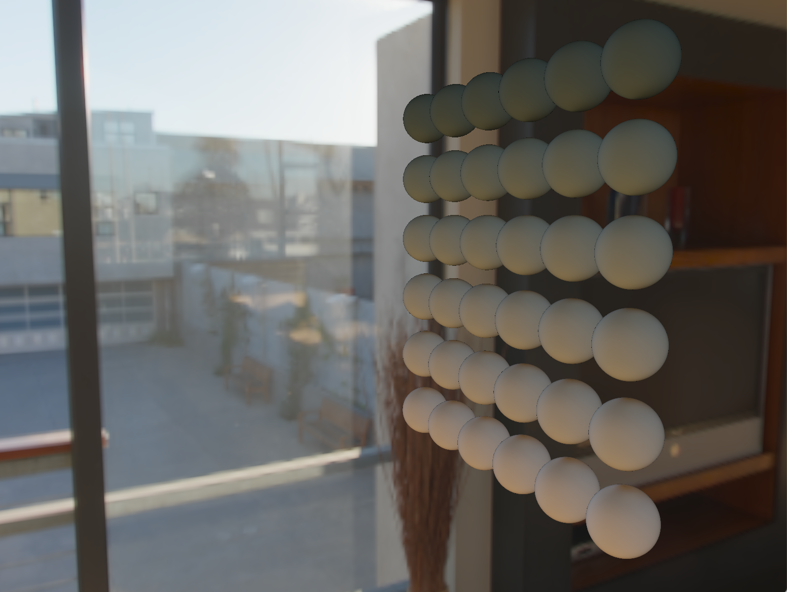

#### 1. understanding of Equirectangular to cubemap algorithm
```GLSL
#version 330 core
out vec4 FragColor;
in vec3 localPos;

uniform sampler2D equirectangularMap;

const vec2 invAtan = vec2(0.1591, 0.3183);
vec2 SampleSphericalMap(vec3 v)
{
    vec2 uv = vec2(atan(v.z, v.x), asin(v.y));
    uv *= invAtan;
    uv += 0.5;
    return uv;
}

void main()
{		
    vec2 uv = SampleSphericalMap(normalize(localPos)); // make sure to normalize localPos
    vec3 color = texture(equirectangularMap, uv).rgb;
    
    FragColor = vec4(color, 1.0);
}
```
&emsp;&emsp;First of all we need to know the ```vec2(0.1591, 0.3183)```is ```vec2(1/2π, 1/π)```. To understand the code, we can observe the following equirectangular first (referenced from learnopengl):


&emsp;&emsp;Then we can divide the legend into 6 area (viewer is outside the cube) and add the coordinate:

And the 3d coordinate is:

&emsp;&emsp;The main idea to understand the algorithm is to use [0, 2π] between x and z in 3d coordinate to represent [0.0, 1.0] in 2d coordinate x-value and use [0, π] between x and y in 3d coordinate to represent [0.0, 1.0] in 2d coordinate y-value.
&emsp;&emsp;We start from the left area of the right area's center (0.0, 0.5).  In the 3d coordinate, this center point should be (1.0, 0.0, 0.0). The we move the center point of the right area to the back area center point which is represented by (0.25, 0.5) in 2d coordinate and (0.0, 0.0, -1.0) in 3d coordinate. The 2d x axis is add up to 0.25 from 0.0, but reduce from 1.0 to 0.0. During this process, we go through π/2 from (1.0, 0.0, 0.0) to (0.0, 0.0, -1.0) in 3d and 0.25 in 2d. Thus we can use π/2 to get 0.25 by doing ```(π/2) * (1/2π)```. But how can we get the angle(radian) between (1.0, 0.0, 0.0) and (0.0, 0.0, -1.0)? Image the process of moving (1.0, 0.0, 0.0) to (0.0, 0.0, -1.0) on a circle, you can find that x value is decreasing in positive direction and the z value is increasing in negative direction, and in the meantime the angle is increasing. It's tangent! So we can use atan(z-value, x-value) to calculate the angle(radian). Because ```-arctan(x) = arctan(-x)```, so we can use (0.0, 0.0, 1.0) instead of (0.0, 0.0, -1.0) to get the same result. But if we use (0.0, 0.0, 1.0), the 2d coordinate should be (0.75, 0.5) instead of (0.25, 0.5), so we need to add 0.5 to the 2d x-value. That's the why we use atan(z, x) as 2d x-value and then multiply 1/2π and add 0.5 on x-value.
&emsp;&emsp;As for y-value in 2d coordinate, we assump that (x, 0.0) and (x, 1.0) correspond to (x, -1.0, z) and (x, 1.0, z). If y-value in 3d moves to (x, 1.0, z) starting from the (x, -1.0, z), it will go through from 0π to π. 
If we can get the angle, the we can get the 2d coordinate. ```y = -arccos(x) + π (x ∈ [-1, 1], y ∈ [0, π])``` can achieve this. And ```y = -arccos(x) + π (x ∈ [-1, 1], y ∈ [0, π])``` is exactly equals to ```y = arcsin(x) + π/2```. Thus if we multiply 1/π with the latter equation, we can get the 2d coordinate y-value ∈ [0, 1]. That's the why we use asin(y) as 2d y-value and then multiply 1/π and add 0.5 on y-value.

#### 2. understanding of dω(area) in reflection integral
&emsp;&emsp;The following legend and equation are referred from [learnOpenGL.com](learnopengl.com):


&emsp;&emsp;In the legend, we can see that ```dω = cosθ * dθ * sinθ * dφ```. In my opinion, it can be understood like this:

&emsp;&emsp;We assump the ```r = 1.0``` and in the vertical orientation (red circle), each segment can be seen as dθ and dφ in horizontal orientation (blue circle). These segments are radian. Thus the arc length can be calculate with ```l = r * α (α means radians)```. In vertical orientation, radius is ```r * cosθ``` and ```r * sinθ``` in horizontal orientation. Thus the solid angle can be calculate as ```r * sinθ * dθ * r * cosθ * dφ = sinθ * cosθ * dφ * dθ (r = 1.0)```.

#### 3. the finall effect
&emsp;&emsp;As for me, it's difficult to find the different in the finall effect legend of learnopengl.com. So I remove the sphere color and reflection equation result Lo, the finall diffuse effect sees like this:
