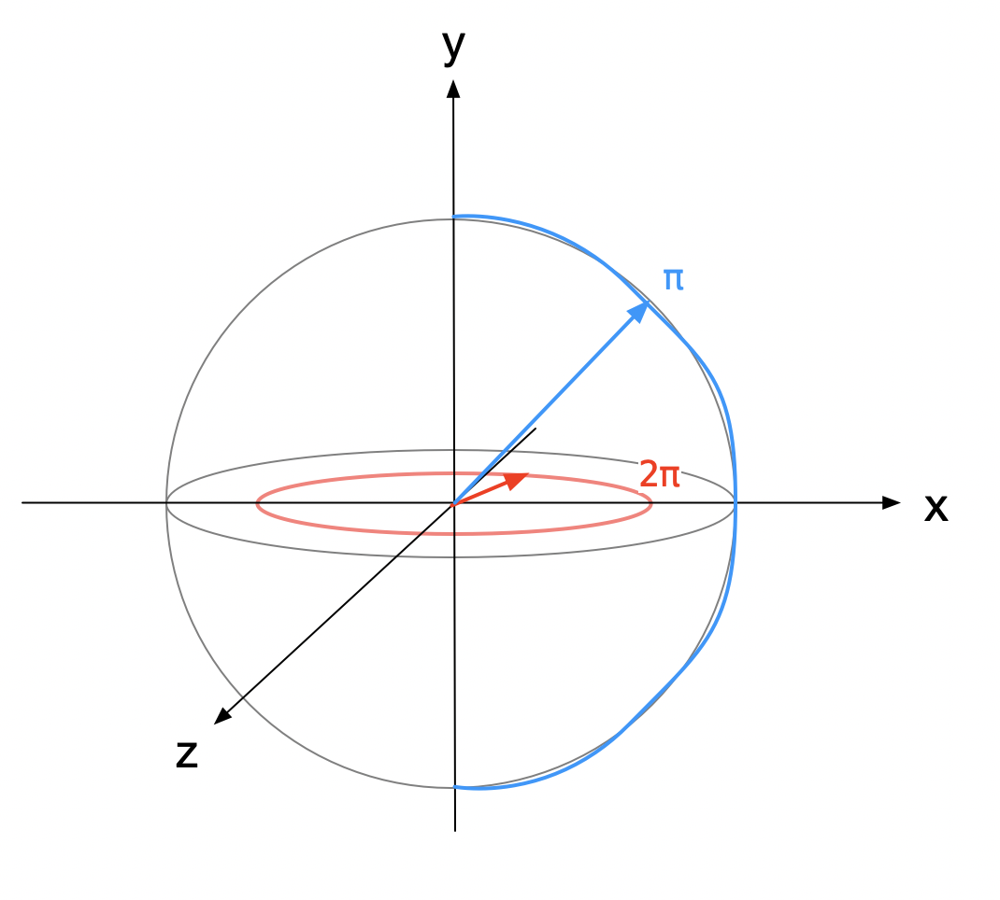
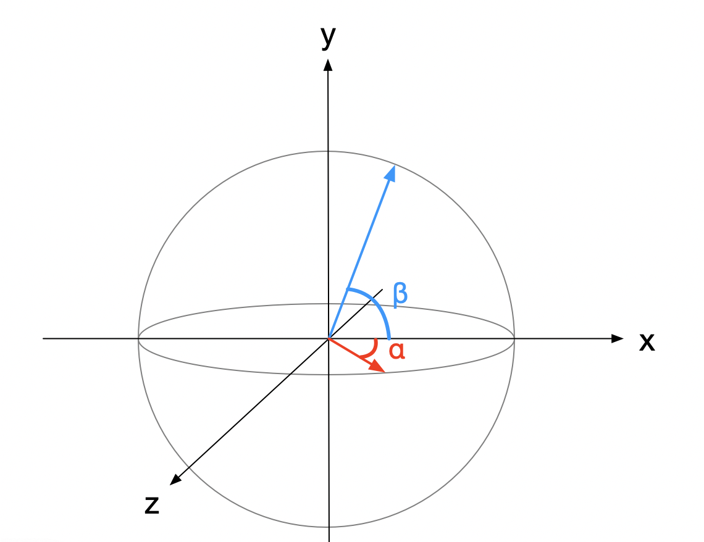
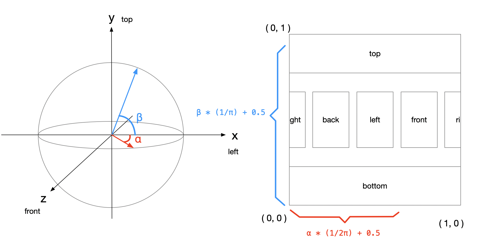
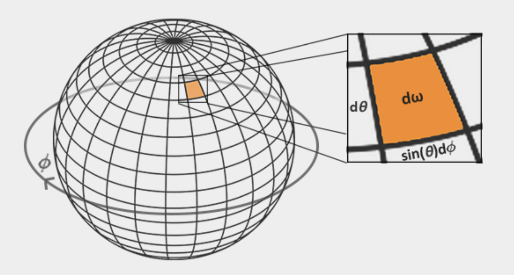
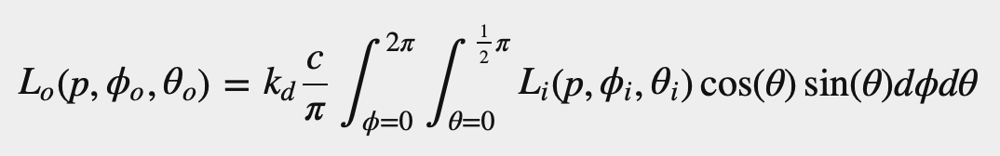

#### 1. understanding of Equirectangular to cubemap algorithm
```GLSL
#version 330 core
out vec4 FragColor;
in vec3 localPos;

uniform sampler2D equirectangularMap;

const vec2 invAtan = vec2(0.1591, 0.3183);
vec2 SampleSphericalMap(vec3 v)
{
    vec2 uv = vec2(atan(v.z, v.x), asin(v.y));
    uv *= invAtan;
    uv += 0.5;
    return uv;
}

void main()
{		
    vec2 uv = SampleSphericalMap(normalize(localPos)); // make sure to normalize localPos
    vec3 color = texture(equirectangularMap, uv).rgb;
    
    FragColor = vec4(color, 1.0);
}
```
&emsp;&emsp;To understand the code, we can use two examples.
&emsp;&emsp;Take localPos = vec3(0, 0, 1), then we can get uv = vec2(0.75, 0.5). Take localPos = vec3(0, 1, 0), then we can get uv = vec2(0.5, 1)
&emsp;&emsp;```atan(v.z, v.x)``` means arctan(z/x), which can get the radians of the angle between z and x (beginning from x). 
&emsp;&emsp;```const vec2 invAtan = vec2(0.1591, 0.3183);``` means vec2(1/2π, 1/π) and can be understood as creating a sphere needs 2π in x-v coordinate and π in y coordinate like following legend:

&emsp;&emsp;According to the two example, we can know that the angle between the z and x is α and the angle between y and x is β like following legend:

&emsp;&emsp;As for 
```GLSL
    vec2 uv = vec2(atan(v.z, v.x), asin(v.y));
    uv *= invAtan;
    uv += 0.5;
```
it calculates the u and v coordinate by angles, invAtan and a offset (0.5). The invAtan can be seen as a unit. α * (1/2π) can be seen as u coordinate in equirectangular and β * (1/π) is v coordinate. Like following legend:


#### 2. understanding of dω(area) in reflection integral
&emsp;&emsp;The following legend and equation are referred from [learnOpenGL.com](learnopengl.com):


&emsp;&emsp;In the legend, we can see that ```dω = cosθ * dθ * sinθ * dφ```. In my opinion, it can be understood like this:

&emsp;&emsp;We assump the ```r = 1.0``` and in the vertical orientation (red circle), each segment can be seen as dθ and dφ in horizontal orientation (blue circle). These segments are radian. Thus the arc length can be calculate with ```l = r * α (α means radians)```. In vertical orientation, radius is ```r * cosθ``` and ```r * sinθ``` in horizontal orientation. Thus the solid angle can be calculate as ```r * sinθ * dθ * r * cosθ * dφ = sinθ * cosθ * dφ * dθ (r = 1.0)```.

#### 3. the finall effect
&emsp;&emsp;As for me, it's difficult to find the different in the finall effect legend of learnopengl.com. So I remove the sphere color and reflection equation result Lo, the finall diffuse effect sees like this:
